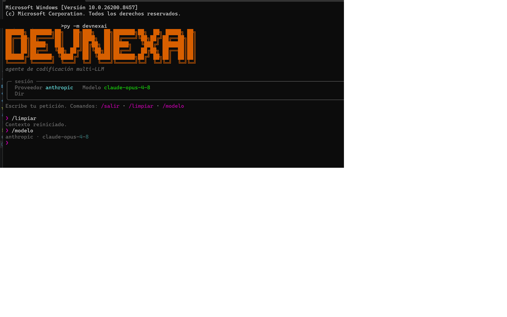
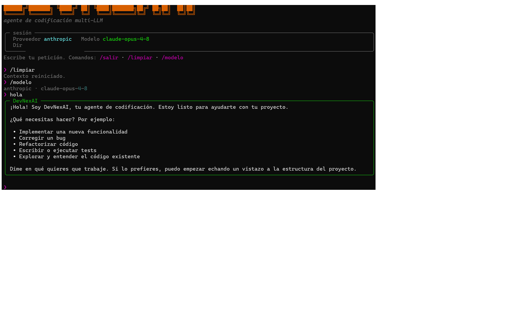
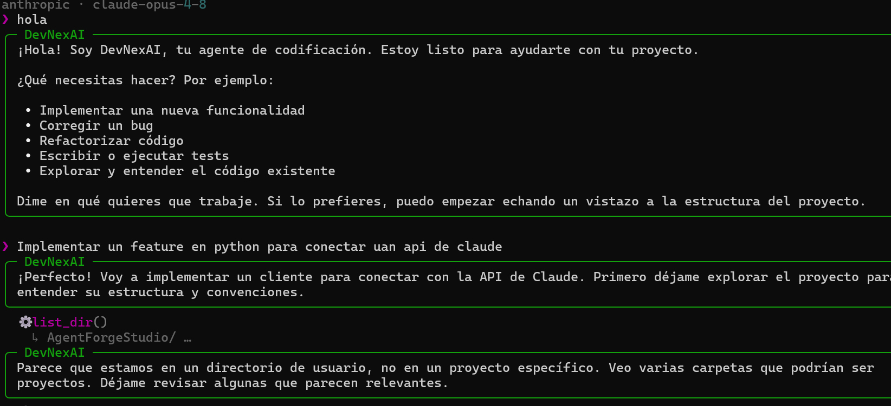
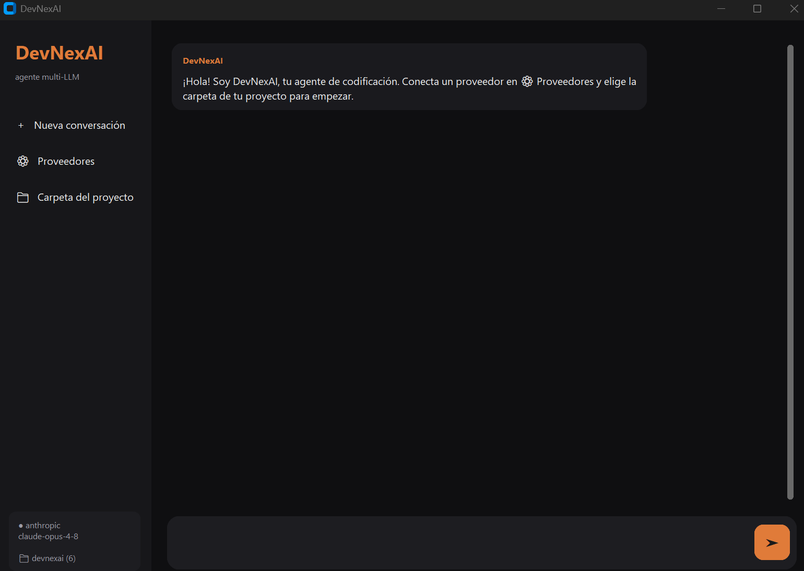
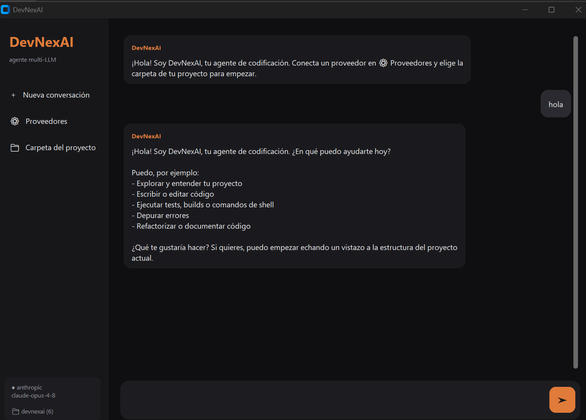
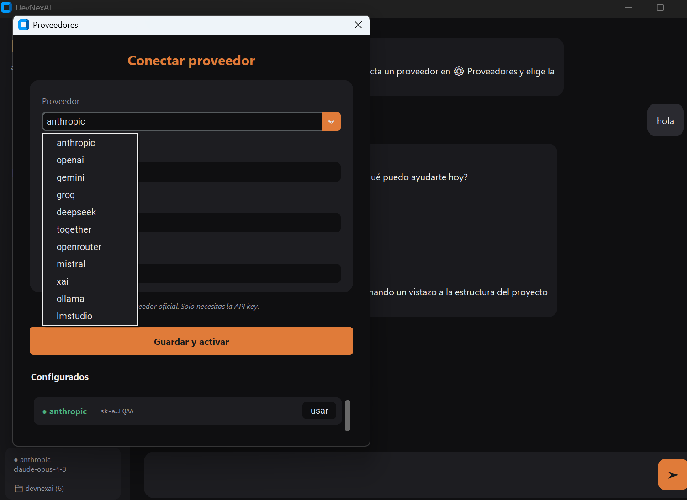

<div align="center">

# DevNexAI.com


**An agentic, multi-LLM coding assistant for your terminal and desktop.**
*Un asistente de código agéntico y multi-LLM para tu terminal y escritorio.*

[](https://www.python.org/)
[](LICENSE)
[]()

</div>









---

## English

DevNexAI is a coding agent inspired by tools like Claude Code, with three things that set it apart: it works with **any LLM provider** (including local, offline models), it ships as both a **terminal CLI and a desktop GUI**, and it's built with first-class **Spanish** support for the Latin American developer community.

### Why it's different

- **Bring your own model.** Anthropic, OpenAI, Gemini, Groq, DeepSeek, Together, OpenRouter, Mistral, xAI - and **local models with zero internet** via Ollama or LM Studio. Switch providers anytime.
- **Truly agentic.** A real tool-use loop: the agent plans, reads and writes files, runs shell commands, verifies its own work, and recovers from errors autonomously (up to 50 steps per task).
- **Safety-aware.** Detects destructive commands (`rm -rf`, force-push, formatting, fork bombs, etc.) and asks for explicit confirmation before running them.
- **Persistent memory.** Remembers project context and notes between sessions.
- **Two interfaces.** A polished terminal CLI (with syntax highlighting and a live plan view) and a modern desktop app.

### Features

| Capability | Description |
|---|---|
| Multi-LLM | Cloud and local providers under one interface |
| Agentic loop | Plan -> act -> verify -> continue |
| Tools | read / write / edit files, list dirs, run shell |
| Planning | Live sub-task list the agent maintains |
| Safety | Confirmation prompts for dangerous commands |
| Memory | Per-project recall across sessions |
| Offline | Run fully local with Ollama / LM Studio |

### Installation

```bash
git https://github.com/Barto12/devnexai-coding-agent-.git
cd devnexai
pip install -e .
```

Requires Python 3.9+.

### Quick start

```bash
# Connect a provider (you'll be prompted for your API key)
devnexai config add anthropic

# Or set up a local, offline model
devnexai config local

# Launch the terminal CLI
devnexai

# Or launch the desktop app
python -m devnexai.gui
```

### Usage

```bash
devnexai                          # interactive REPL
devnexai "refactor utils.py"      # one-shot task
devnexai config list              # show configured providers
devnexai config use groq          # switch active provider
```

REPL commands: `/exit`, `/clear`, `/plan`, `/model`, `/forget`.

### Build a standalone executable

```bash
build_exe.bat        # Windows - produces dist/DevNexAI.exe
```

An Inno Setup script (`installer.iss`) is included to generate a Windows installer with desktop and start-menu shortcuts.

### Architecture

```
devnexai/
|- agent.py       # agentic loop (LLM <-> tools)
|- providers.py   # normalized adapters for each LLM
|- tools.py       # filesystem + shell tools
|- safety.py      # dangerous-command detection
|- memory.py      # cross-session memory
|- config.py      # API key & provider storage
|- ui.py          # terminal interface (rich)
|- cli.py         # CLI entrypoint
|- gui.py         # desktop app (CustomTkinter)
```

API keys are stored outside the codebase (in `~/.devnexai/`), so the repo never contains secrets.

---

## Espanol

DevNexAI es un agente de codificacion inspirado en herramientas como Claude Code, con tres cosas que lo distinguen: funciona con **cualquier proveedor de LLM** (incluidos modelos locales sin internet), viene como **CLI de terminal y app de escritorio**, y esta pensado con soporte de primera clase para **espanol** y la comunidad de desarrolladores en Latinoamerica.

### Por que es diferente

- **Usa tu propio modelo.** Anthropic, OpenAI, Gemini, Groq, DeepSeek, Together, OpenRouter, Mistral, xAI - y **modelos locales sin conexion** con Ollama o LM Studio. Cambia de proveedor cuando quieras.
- **Verdaderamente agentico.** Un loop real de uso de herramientas: planifica, lee y escribe archivos, ejecuta comandos, verifica su trabajo y se recupera de errores solo (hasta 50 pasos por tarea).
- **Consciente de la seguridad.** Detecta comandos destructivos y pide confirmacion explicita antes de ejecutarlos.
- **Memoria persistente.** Recuerda el contexto del proyecto entre sesiones.
- **Dos interfaces.** Una CLI de terminal pulida y una app de escritorio moderna.

### Instalacion

```bash
git clone https://github.com/Barto12/devnexai-coding-agent-.git
cd devnexai
pip install -e .
```

Requiere Python 3.9+.

### Inicio rapido

```bash
devnexai config add anthropic     # conecta un proveedor (te pide la API key)
devnexai config local             # o configura un modelo local sin internet
devnexai                          # abre la CLI de terminal
python -m devnexai.gui            # o abre la app de escritorio
```

Comandos del REPL: `/salir`, `/limpiar`, `/plan`, `/modelo`, `/olvidar`.

### Generar el ejecutable

```bash
build_exe.bat        # Windows - genera dist/DevNexAI.exe
```

Incluye un script de Inno Setup (`installer.iss`) para crear un instalador de Windows con accesos directos en el escritorio y el menu inicio.

---

<div align="center">

Built by **DevNexAI** - Construido por **DevNexAI**

</div>
